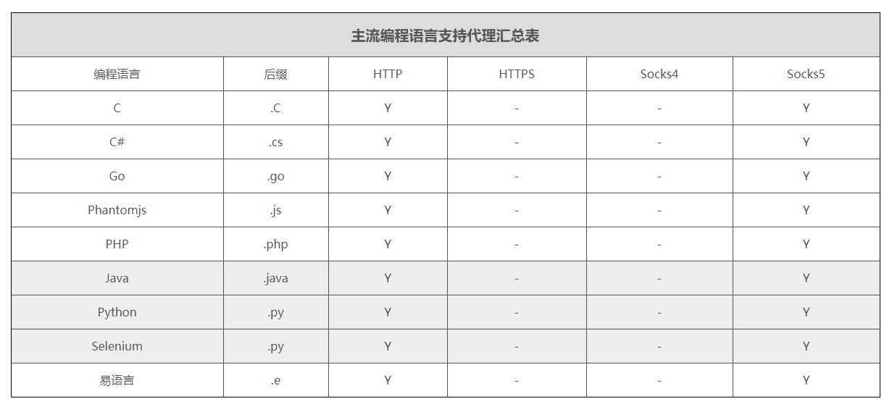

      
  
<br/>     
<br/>     

      
编程语言之代理协议
----------




     
  
<br/>     
<br/>     

     
编程语言之代理示例
----------

#### 1. PHP 设置代理

```php
//Php http/sock5:

/**
 * PHP 支持 http、socks5
 *
 * curl不是php原生库，需要安装库:
 * Ubuntu系统：sudo apt-get -y install php5-curl
 * CentOS系统：yum -y install php-curl
 * MacOS 系统：brew install php-curl
 *
 * CURLOPT_PROXYTYPE :
 * 	CURLPROXY_HTTP,    CURLPROXY_HTTP_1_0
 * 	CURLPROXY_SOCKS4,  CURLPROXY_SOCKS4A
 * 	CURLPROXY_SOCKS5,  CURLPROXY_SOCKS5_HOSTNAME
 */

// 要访问的目标页面
$targetUrl = "http://h.wandouip.com";

// 代理服务器
//$proxyServer = "183.164.88.103:5412"; //通过 http://h.wandouip.com/get
$proxyServer = "测试IP:端口号";//通过 http://h.wandouip.com/get

// 隧道身份信息
$ch = curl_init();
curl_setopt($ch, CURLOPT_URL, $targetUrl);
curl_setopt($ch, CURLOPT_HTTPPROXYTUNNEL, false);
curl_setopt($ch, CURLOPT_SSL_VERIFYPEER, false);

// 设置代理服务器
//curl_setopt($ch, CURLOPT_PROXYTYPE, 0); //http
curl_setopt($ch, CURLOPT_PROXYTYPE, 5); //sock5
curl_setopt($ch, CURLOPT_PROXY, $proxyServer);
// 设置隧道验证信息
curl_setopt($ch, CURLOPT_PROXYAUTH, CURLAUTH_BASIC);
//curl_setopt($ch, CURLOPT_PROXYAUTH, false);

curl_setopt($ch, CURLOPT_PROXYUSERPWD, "用户名:密码"); //http sockes 代理认证帐号，名称:pwd的格式

curl_setopt($ch, CURLOPT_USERAGENT, "Mozilla/4.0 (compatible; MSIE 6.0; Windows NT 5.1; SV1; .NET CLR 2.0.50727;)");

curl_setopt($ch, CURLOPT_CONNECTTIMEOUT, 3);

curl_setopt($ch, CURLOPT_TIMEOUT, 5);

curl_setopt($ch, CURLOPT_HEADER, true);

curl_setopt($ch, CURLOPT_RETURNTRANSFER, true);

$result = curl_exec($ch);

curl_close($ch);

var_dump($result);
		
```
  
<br/>      
	
	
#### 2. Python 设置代理

#!/usr/bin/env python
#Python http/sock5:


#coding=utf-8
import requests

#请求地址
targetUrl = "http://h.wandouip.com"

#代理服务器
proxyHost = "ip"
proxyPort = "port"

proxyMeta = "http://%(host)s:%(port)s" % {

    "host" : proxyHost,
    "port" : proxyPort,
}

#pip install -U requests[socks]  socks5代理
# proxyMeta = "socks5://%(host)s:%(port)s" % {

#     "host" : proxyHost,

#     "port" : proxyPort,

# }

proxies = {

    "http"  : proxyMeta,
    "https" : proxyMeta,
}

resp = requests.get(targetUrl, proxies=proxies)
print resp.status_code
print resp.text
	
<br/>      
	
	
#### 3. Java 设置代理

```java
#java http/sock5:

import java.io.ByteArrayOutputStream;
import java.io.IOException;
import java.io.InputStream;
import java.net.Authenticator;
import java.net.InetSocketAddress;
import java.net.PasswordAuthentication;
import java.net.Proxy;
import java.net.URL;
import java.net.URLConnection;
import java.nio.charset.StandardCharsets;
                   --------------------------------http代理-------------------------------------------------
public class ClientProxyBasicHttp {

	public static void main(String args[]) throws Exception {
		// 目标地址
		String targetUrl = "http://h.wandouip.com";

		// 代理服务器
		String proxyHost = "测试IP"; //通过 http://h.wandouip.com/get获取
		int proxyPort = 端口号;

		// http代理: Proxy.Type.HTTP, socks代理: Proxy.Type.SOCKS
		Proxy.Type proxyType = Proxy.Type.HTTP;

		// 代理验证
		String proxyUser = "用户名";
		String proxyPwd = "密码";

		try {
			// 设置验证
			Authenticator.setDefault(new ProxyAuthenticator(proxyUser, proxyPwd));
			// 创建代理服务器
			InetSocketAddress addr = new InetSocketAddress(proxyHost, proxyPort);
			Proxy proxy = new Proxy(proxyType, addr);
			// 访问目标网页
			URL url = new URL(targetUrl);
			URLConnection conn = url.openConnection(proxy);

			String headerKey = "Proxy-Authorization";
			String headerValue = "Basic " + Base64.getEncoder().encodeToString((proxyUser+":"+proxyPwd).getBytes("utf-8"));
			conn.setRequestProperty(headerKey, headerValue);
			// 读取返回数据
			InputStream in = conn.getInputStream();
			// 将返回数据转换成字符串
			System.out.println(IO2String(in));

		} catch (Exception e) {
			e.printStackTrace();
		}

	}

	/**
	 * 将输入流转换成字符串
	 *
	 * @param inStream
	 * @return
	 * @throws IOException
	 */
	public static String IO2String(InputStream inStream) throws IOException {
		ByteArrayOutputStream result = new ByteArrayOutputStream();
		byte[] buffer = new byte[1024];
		int len;
		while ((len = inStream.read(buffer)) != -1) {
			result.write(buffer, 0, len);
		}
		String str = result.toString(StandardCharsets.UTF_8.name());
		return str;
	}

	static class ProxyAuthenticator extends Authenticator {
		private String authUser, authPwd;

		public ProxyAuthenticator(String authUser, String authPwd) {
			this.authUser = authUser;
			this.authPwd = authPwd;
		}

        public PasswordAuthentication getPasswordAuthentication() {
            return (new PasswordAuthentication(authUser, authPwd.toCharArray()));
        }
    }
}

                    -------------------------------socks代理------------------------------------------
  public class ClientProxyBasicSocks {

	public static void main(String args[]) throws Exception {
		// 目标地址
		String targetUrl = "http://h.wandouip.com";

		// 代理服务器
		String proxyHost = "测试IP"; //通过http://h.wandouip.com/get
		int proxyPort = 端口号;

		// 代理验证
		String proxyUser = "用户名";
		String proxyPwd = "密码";

		// http代理: Proxy.Type.HTTP, socks代理: Proxy.Type.SOCKS
		Proxy.Type proxyType = Proxy.Type.SOCKS;
		try {
			// 设置验证
			Authenticator.setDefault(new ProxyAuthenticator(proxyUser, proxyPwd));
			// 创建代理服务器
			InetSocketAddress addr = new InetSocketAddress(proxyHost, proxyPort);
			Proxy proxy = new Proxy(proxyType, addr);
			// 访问目标网页
			URL url = new URL(targetUrl);
			URLConnection conn = url.openConnection(proxy);

			String headerKey = "Proxy-Authorization";
			String headerValue = "Basic " + Base64.getEncoder().encodeToString((proxyUser+":"+proxyPwd).getBytes("utf-8"));
			conn.setRequestProperty(headerKey, headerValue);
			// 读取返回数据
			InputStream in = conn.getInputStream();
			// 将返回数据转换成字符串
			System.out.println(IO2String(in));

		} catch (Exception e) {
			e.printStackTrace();
		}

	}

	/**
	 * 将输入流转换成字符串
	 *
	 * @param inStream
	 * @return
	 * @throws IOException
	 */
	public static String IO2String(InputStream inStream) throws IOException {
		ByteArrayOutputStream result = new ByteArrayOutputStream();
		byte[] buffer = new byte[1024];
		int len;
		while ((len = inStream.read(buffer)) != -1) {
			result.write(buffer, 0, len);
		}
		String str = result.toString(StandardCharsets.UTF_8.name());
		return str;
	}


	static class ProxyAuthenticator extends Authenticator {
		private String authUser, authPwd;

		public ProxyAuthenticator(String authUser, String authPwd) {
			this.authUser = authUser;
			this.authPwd = authPwd;
		}

		public PasswordAuthentication getPasswordAuthentication() {
			return (new PasswordAuthentication(authUser, authPwd.toCharArray()));
		}
	}

}
```
 
<br/>      
	
	
#### 4. Go 设置代理

```
package main

import (
	"encoding/base64"
	_ "encoding/base64"
	"fmt"
	"io/ioutil"
	"net/http"
	"net/url"
	_ "strings"
)

//sock5代理
func socksproxy() {
	urli := url.URL{}
	urlproxy, _ := urli.Parse("http://测试IP:端口") //通过http://h.wandouip.com
	client := &http.Client{
		Transport: &http.Transport{
			Proxy: http.ProxyURL(urlproxy),

		},
	}
	rqt, err := http.NewRequest("GET", "http://h.wandouip.com", nil)
	if err != nil {
		println("接口获取IP失败!")
		return
	}
	username := "用户名"
	password := "密码"
	str := username +":"+ password;
	basic := base64.StdEncoding.EncodeToString([]byte(str))
	basic1 :="Basic "
	value:=basic1+basic
	//fmt.Print(value);
	rqt.Header.Add("User-Agent", "Lingjiang")
	rqt.Header.Add("Proxy-Authorization",value)
	response, _ := client.Do(rqt)
	defer response.Body.Close()
	body, err := ioutil.ReadAll(response.Body)
	if err != nil {
		return
	}
	fmt.Println("socks5:", string(body))
	return

}

//http代理
func httpproxy() {
	urli := url.URL{}
	urlproxy, _ := urli.Parse("http://测试IP:端口号") //通过http://h.wandouip.com/get获取
	client := &http.Client{
		Transport: &http.Transport{
			Proxy: http.ProxyURL(urlproxy),
		},
	}
	rqt, err := http.NewRequest("GET", "http://h.wandouip.com", nil)
	if err != nil {
		println("接口获取IP失败!")
		return
	}
	//
	username := "用户名"
	password := "密码"
	str := username +":"+ password;
	basic := base64.StdEncoding.EncodeToString([]byte(str))
	basic1 :="Basic "
	value:=basic1+basic
	//fmt.Print(value);
	rqt.Header.Add("User-Agent", "Lingjiang")
	rqt.Header.Add("Proxy-Authorization",value)
	//处理返回结果
	response, _ := client.Do(rqt)
	defer response.Body.Close()
	body, err := ioutil.ReadAll(response.Body)
	if err != nil {
		return
	}
	fmt.Println("http:", string(body))
	return

}

//本机IP
func httplocal() {
	client := &http.Client{}
	rqt, err := http.NewRequest("GET", "http://h.wandouip.com", nil)
	if err != nil {
		println("接口获取IP失败!")
		return
	}

	rqt.Header.Add("User-Agent", "Lingjiang")
	//处理返回结果
	response, _ := client.Do(rqt)
	defer response.Body.Close()
	body, err := ioutil.ReadAll(response.Body)
	if err != nil {
		return
	}

	fmt.Println("本机:", string(body))
	return

}
func main() {
	//httplocal()
	httpproxy()
	//socksproxy()
}
    
```
	
<br/>


#### 5. CSharp 设置代理

```
using System;
using System.Collections.Generic;
using System.Globalization;
using System.Linq;
using System.Net.Http;
using System.Text;
using System.Threading.Tasks;
namespace ClientProxyDemo
{
    class TestProxy
    {
        static void Main(string[] args)
        {
            String proxyServer = "http://测试Ip:端口"; // http://host:port, 例(http://1.2.3.4:7777), host可以是域名或者ip,port是代理端口号 通过http://h.wandouip.com/get获取
            WebProxy proxy = new WebProxy(proxyServer);
            HttpClientHandler httpClientHandler = new HttpClientHandler()
            {
                Proxy = proxy
            };
            HttpClient httpCient = new HttpClient(httpClientHandler);
            String username = "用户名";
            String password = "密码";
            byte[] bytes = Encoding.Default.GetBytes(username + ":" + password);
            String str = Convert.ToBase64String(bytes);

            // 增加头部
            httpCient.DefaultRequestHeaders.Add("Proxy-Authorization", "Basic " + str);

            TestProxy testProxy = new TestProxy();
            testProxy.testGet(httpCient);
            // testProxy.testPost(httpCient);
        }


        // 测试get请求
        public void testGet(HttpClient httpClient)
        {
            String targetUrl = "http://h.wandouip.com";
            var httpResult = httpClient.GetStringAsync(targetUrl).Result;
        }

        // 测试post请求
        public void testPost(HttpClient httpClient)
        {
            String targetUrl = "http://h.wandouip.com/post";
            List> formData = new List>();
            formData.Add(new KeyValuePair("key1", "vaule1"));
            formData.Add(new KeyValuePair("key2", "vaule2"));
            var formContent = new FormUrlEncodedContent(formData.ToArray());
            var responseMsg = httpClient.PostAsync(targetUrl, formContent).Result;
            var httpResult = responseMsg.Content.ReadAsStringAsync().Result;
        }
    }
}
```
	
<br/>      


#### 6. C 设置代理

```
; C 支持 http/socks5
// demo.cpp : 定义控制台应用程序的入口点。
//

#include "stdafx.h"
#include "curl/curl.h"
#include 
#pragma comment(lib, "libcurl.lib")
static size_t write_buff_data(char *buffer, size_t size, size_t nitems, void *outstream)
{
	memcpy(outstream, buffer, nitems*size);
	return nitems * size;
}
/*
使用http代理
*/
int GetUrlHTTP(char *url, char *buff, char *out_data)
{
	CURL *curl;
	CURLcode res;
	curl = curl_easy_init();
	if (curl)
	{
		curl_easy_setopt(curl, CURLOPT_PROXY, "http://测试IP:端口");//通过http://h.wandouip.com/get获取
		curl_easy_setopt(curl, CURLOPT_WRITEDATA, (void*)buff);
		curl_easy_setopt(curl, CURLOPT_WRITEFUNCTION, write_buff_data);
		curl_easy_setopt(curl, CURLOPT_URL, url);
		curl_easy_setopt(curl, CURLOPT_LOW_SPEED_TIME, 10L);
		curl_easy_setopt(curl, CURLOPT_LOW_SPEED_LIMIT, 50L);
		curl_easy_setopt(curl, CURLOPT_MAX_RECV_SPEED_LARGE, 2000000L);/*下载最高速度*/
		curl_easy_setopt(curl, CURLOPT_PROXYAUTH, CURLAUTH_BASIC);/*设置代理验证信息*/
		curl_easy_setopt(curl, CURLOPT_PROXYUSERPWD, out_data);/*设置代理认证的用户名和密码*/
		res = curl_easy_perform(curl);

		curl_easy_cleanup(curl);
		if (res == CURLE_OK) {
			return res;
		}
		else {
			printf("错误代码:%d\n", res);
			MessageBox(NULL, TEXT("获取IP错误"), TEXT("助手"), MB_ICONINFORMATION | MB_YESNO);
		}
	}
	return res;
}
/*
使用socks5代理
*/
int GetUrlSocks5(char *url, char *buff,char *out_data)
{
	CURL *curl;
	CURLcode res;
	curl = curl_easy_init();
	if (curl)
	{

		curl_easy_setopt(curl, CURLOPT_PROXY, "socks5://测试IP:端口号");//通过http://h.wandouip.com/get获取
		curl_easy_setopt(curl, CURLOPT_WRITEDATA, (void*)buff);
		curl_easy_setopt(curl, CURLOPT_WRITEFUNCTION, write_buff_data);
		curl_easy_setopt(curl, CURLOPT_URL, url);
		curl_easy_setopt(curl , CURLOPT_PROXYTYPE, 5); //sock5
		curl_easy_setopt(curl, CURLOPT_LOW_SPEED_TIME, 10L);
		curl_easy_setopt(curl, CURLOPT_LOW_SPEED_LIMIT, 50L);
		curl_easy_setopt(curl, CURLOPT_MAX_RECV_SPEED_LARGE, 2000000L);/*下载最高速度*/
		curl_easy_setopt(curl, CURLOPT_PROXYAUTH, CURLAUTH_BASIC);/*设置代理验证信息*/
		curl_easy_setopt(curl, CURLOPT_PROXYUSERPWD, out_data);/*设置代理认证的用户名和密码*/
		res = curl_easy_perform(curl);
		curl_easy_cleanup(curl);
		if (res == CURLE_OK) {
			return res;
		}
		else {
			printf("错误代码:%d\n", res);
			MessageBox(NULL, TEXT("获取IP错误"), TEXT("助手"), MB_ICONINFORMATION | MB_YESNO);
		}
	}
	return res;
}
int GetUrl(char *url, char *buff)
{
	CURL *curl;
	CURLcode res;
	curl = curl_easy_init();
	if (curl)
	{

		curl_easy_setopt(curl, CURLOPT_WRITEDATA, (void*)buff);
		curl_easy_setopt(curl, CURLOPT_WRITEFUNCTION, write_buff_data);
		curl_easy_setopt(curl, CURLOPT_URL, url);
		curl_easy_setopt(curl, CURLOPT_LOW_SPEED_TIME, 10L);
		curl_easy_setopt(curl, CURLOPT_LOW_SPEED_LIMIT, 50L);
		curl_easy_setopt(curl, CURLOPT_MAX_RECV_SPEED_LARGE, 2000000L);/*下载最高速度*/
		res = curl_easy_perform(curl);
		curl_easy_cleanup(curl);
		if (res == CURLE_OK)
		{
			return res;
		}
		else {
			printf("错误代码:%d\n", res);
			MessageBox(NULL, TEXT("获取IP错误"), TEXT("助手"), MB_ICONINFORMATION | MB_YESNO);
		}
	}
	return res;
}


int main()
{
	char *buff = (char*)malloc(1024 * 1024);
	memset(buff, 0, 1024 * 1024);

	//GetUrl("http://h.wandouip.com", buff);
	//printf("不使用代理：%s\n", buff);
	char *username = "用户账号";
	char *password = "用户密码";

	char *l = ":";
	char *out_data = (char *)malloc(strlen(username) + strlen(password) + strlen(l));
	sprintf(out_data, "%s%s%s", username, l, password);

	memset(buff, 0, 1024 * 1024);
	GetUrlHTTP("http://h.wandouip.com", buff,out_data);
	printf("http结果：%s\n", buff);

	memset(buff, 0,1024 * 1024);
	GetUrlSocks5("http://h.wandouip.com", buff,out_data);
	printf("socks5结果：%s\n", buff);


	Sleep(1000 * 1000);
	free(buff);
	return 0;
}

```
	
<br/> 


#### 7. PhantomJs 设置代理

```

                    //demo.js
                    var page = require('webpage').create(),
                    system = require('system'),
                    address;
                if (system.args.length === 1) {
                        console.log(system.args)
                    } else {

                    //console.log(system.args)
                    address = 'http://h.wandouip.com';
                    page.open(address, function (status) {
                    console.log(page.content)
                    phantom.exit();
                });
                    }

                    //命令行执行
                    phantomjs --proxy=ip:port --proxy-type=[http|socks5|https] demo.js
	  
```
	
<br/>


#### 8. Selenium 设置代理

```
#Python selenium http/socks5:
#coding=utf-8
from selenium import webdriver
from selenium.webdriver.common.desired_capabilities import DesiredCapabilities
import base64
# 代理服务器
proxyHost = "测试IP" #通过http://h.wandouip.com/get获取
proxyPort = "端口号"
proxyType='socks5' #socks5
username="用户名"
password="密码"
# 代理隧道验证信息
service_args = [
    "--proxy-type=%s" % proxyType,
    "--proxy=%(host)s:%(port)s" % {
        "host" : proxyHost,
        "port" : proxyPort,
    }
    ]
def base_code(username, password):
    str = '%s:%s' % (username, password)
    encodestr = base64.b64encode(str.encode('utf-8'))
    return '%s' % encodestr.decode()

authentication_token = "Basic " + base_code(username,password)
capa = DesiredCapabilities.PHANTOMJS
capa['phantomjs.page.customHeaders.Proxy-Authorization'] = authentication_token
driver = webdriver.PhantomJS(executable_path="D:\phpStudy\PHPTutorial\WWW\phantomjs-2.1.1-windows\phantomjs.exe",desired_capabilities=capa, service_args=service_args)
# 要访问的目标页面
targetUrl = "http://h.wandouip.com"
driver.get(targetUrl)
# //print (driver.title)
print (driver.page_source.encode("utf-8"))
driver.quit()
            
```
	
<br/>       	
	
#### 9. 易语言 设置代理

```

' 易语言 支持 http https socks5
'


' 获取目标网址
.如果 (目标网址编辑框.内容 ＝ “”)
    目标网址 ＝ “http://h.wandouip.com”
.否则
    目标网址 ＝ 目标网址编辑框.内容

' 获取代理地址
.如果 (代理服务器编辑框.内容 ＝ “”)
    代理地址 ＝ “测试ip:端口”
.否则
    代理地址 ＝ 代理服务器编辑框.内容

.如果结束

输出调试文本 (“代理地址： ” ＋ 代理地址)

' 设置代理方法1
网页_置浏览器代理 (代理地址)  ' 通过浏览器设置，一般只支持http代理
超文本浏览框.跳转 (目标网址编辑框.内容, , )


' 设置代理方法2
输出调试文本 (网页_访问S (目标网址, , , , , , , , , , 代理地址, , ))


' 设置代理方式3（用户名 +　密码）
输出调试文本 (网页_访问S (目标网址, , , , , , , , , , 代理地址, 代理用户名, 代理密码))
		

  
<br/>      
<br/>      
	
