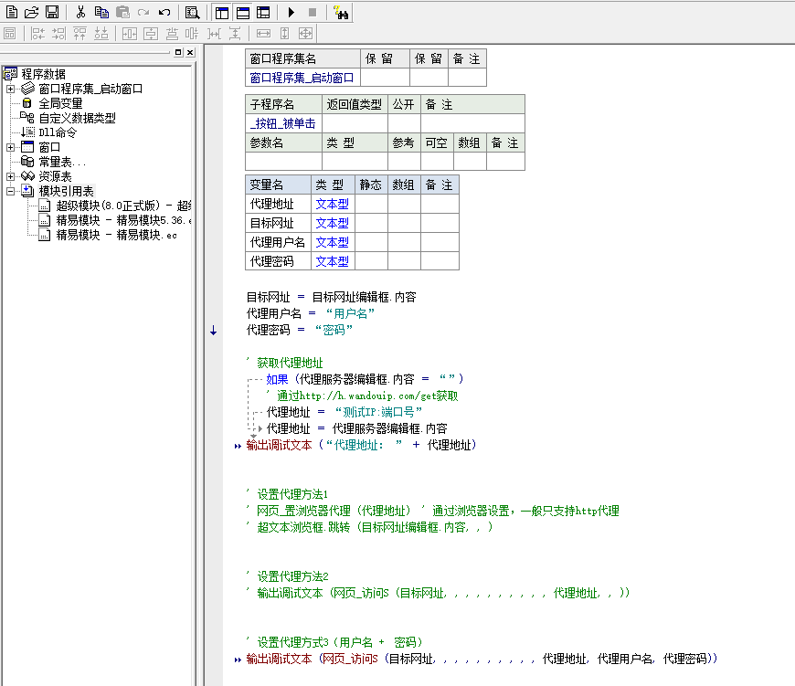

      
  
<br/>     
<br/>     

      
编程语言之代理协议
----------


     
  
<br/>     
<br/>     

     
编程语言之代理示例
----------

#### 1. PHP 设置代理

```php
//Php http/sock5:

// 要访问的目标页面
        $targetUrl = "http://baidu.com";

        // 代理服务器
        $proxyServer = "http://ip:port";

        // 隧道身份信息
        $ch = curl_init();

        curl_setopt($ch, CURLOPT_URL, $targetUrl);

        curl_setopt($ch, CURLOPT_HTTPPROXYTUNNEL, false);

        curl_setopt($ch, CURLOPT_SSL_VERIFYPEER, false);

        // 设置代理服务器
//        curl_setopt($ch, CURLOPT_PROXYTYPE, 0); //http

        curl_setopt($ch, CURLOPT_PROXYTYPE, 5); //sock5

        curl_setopt($ch, CURLOPT_PROXY, $proxyServer);

        // 设置隧道验证信息
        curl_setopt($ch, CURLOPT_PROXYAUTH, CURLAUTH_BASIC);

        curl_setopt($ch, CURLOPT_USERAGENT, "Mozilla/4.0 (compatible; MSIE 6.0; Windows NT 5.1; SV1; .NET CLR 2.0.50727;)");

        curl_setopt($ch, CURLOPT_CONNECTTIMEOUT, 3);

        curl_setopt($ch, CURLOPT_TIMEOUT, 5);

        curl_setopt($ch, CURLOPT_HEADER, true);

        curl_setopt($ch, CURLOPT_RETURNTRANSFER, true);

        $result = curl_exec($ch);

        curl_close($ch);

        var_dump($result);
```
  
<br/>      
	
	
#### 2. Python 设置代理

```python
#Python http/sock5:

#coding=utf-8
import requests

#请求地址
targetUrl = "http://baidu.com"

#代理服务器
proxyHost = "ip"
proxyPort = "port"

proxyMeta = "http://%(host)s:%(port)s" % {

    "host" : proxyHost,
    "port" : proxyPort,
}

#pip install -U requests[socks]  socks5代理
# proxyMeta = "socks5://%(host)s:%(port)s" % {

#     "host" : proxyHost,

#     "port" : proxyPort,

# }

proxies = {

    "http"  : proxyMeta,
    "https" : proxyMeta,
}

resp = requests.get(targetUrl, proxies=proxies)
print resp.status_code
print resp.text
```
	
<br/>      
	
	
#### 3. Java 设置代理

```java
#java http/sock5:


import java.io.ByteArrayOutputStream;
import java.io.IOException;
import java.io.InputStream;
import java.net.Authenticator;
import java.net.InetSocketAddress;
import java.net.PasswordAuthentication;
import java.net.Proxy;
import java.net.URL;
import java.net.URLConnection;
import java.nio.charset.StandardCharsets;

import java.io.ByteArrayOutputStream;
import java.io.IOException;
import java.io.InputStream;
import java.net.InetSocketAddress;
import java.net.Proxy;
import java.net.URL;
import java.net.URLConnection;
import java.nio.charset.StandardCharsets;
                    <!--------------------------------http代理------------------------------------------------->
                    public class ClientProxyBasicHttp {

	public static void main(String args[]) throws Exception {
		// 目标地址
		String targetUrl = "http://httpbin.org/get";

		// 代理服务器
		String proxyHost = "xxx";
		int proxyPort = 0;

		// http代理: Proxy.Type.HTTP, socks代理: Proxy.Type.SOCKS
		Proxy.Type proxyType = Proxy.Type.HTTP;

		// 代理验证
		String proxyUser = "xxx";
		String proxyPwd = "xxx";

		try {
			// 设置验证
			Authenticator.setDefault(new ProxyAuthenticator(proxyUser, proxyPwd));

			// 创建代理服务器
			InetSocketAddress addr = new InetSocketAddress(proxyHost, proxyPort);
			Proxy proxy = new Proxy(proxyType, addr);
			// 访问目标网页
			URL url = new URL(targetUrl);
			URLConnection conn = url.openConnection(proxy);
			// 读取返回数据
			InputStream in = conn.getInputStream();
			// 将返回数据转换成字符串
			System.out.println(IO2String(in));

		} catch (Exception e) {
			e.printStackTrace();
		}

	}

	/**
	 * 将输入流转换成字符串
	 *
	 * @param inStream
	 * @return
	 * @throws IOException
	 */
	public static String IO2String(InputStream inStream) throws IOException {
		ByteArrayOutputStream result = new ByteArrayOutputStream();
		byte[] buffer = new byte[1024];
		int len;
		while ((len = inStream.read(buffer)) != -1) {
			result.write(buffer, 0, len);
		}
		String str = result.toString(StandardCharsets.UTF_8.name());
		return str;
	}

	static class ProxyAuthenticator extends Authenticator {
		private String authUser, authPwd;

		public ProxyAuthenticator(String authUser, String authPwd) {
			this.authUser = authUser;
			this.authPwd = authPwd;
		}

        public PasswordAuthentication getPasswordAuthentication() {
            return (new PasswordAuthentication(authUser, authPwd.toCharArray()));
        }
    }
}


                    <!-------------------------------socks代理------------------------------------------>
                    public class ClientProxyBasicSocks {

	public static void main(String args[]) throws Exception {
		// 目标地址
		String targetUrl = "http://httpbin.org/get";

		// 代理服务器
		String proxyHost = "xxx";
		int proxyPort = 0;

		// http代理: Proxy.Type.HTTP, socks代理: Proxy.Type.SOCKS
		Proxy.Type proxyType = Proxy.Type.SOCKS;
		try {
			// 创建代理服务器
			InetSocketAddress addr = new InetSocketAddress(proxyHost, proxyPort);
			Proxy proxy = new Proxy(proxyType, addr);
			// 访问目标网页
			URL url = new URL(targetUrl);
			URLConnection conn = url.openConnection(proxy);
			// 读取返回数据
			InputStream in = conn.getInputStream();
			// 将返回数据转换成字符串
			System.out.println(IO2String(in));

		} catch (Exception e) {
			e.printStackTrace();
		}

	}

	/**
	 * 将输入流转换成字符串
	 *
	 * @param inStream
	 * @return
	 * @throws IOException
	 */
	public static String IO2String(InputStream inStream) throws IOException {
		ByteArrayOutputStream result = new ByteArrayOutputStream();
		byte[] buffer = new byte[1024];
		int len;
		while ((len = inStream.read(buffer)) != -1) {
			result.write(buffer, 0, len);
		}
		String str = result.toString(StandardCharsets.UTF_8.name());
		return str;
	}

}
```
 
<br/>      
	
	
#### 4. Go 设置代理

```
package main

import (
	"fmt"
	"io/ioutil"
	"net/http"
	"net/url"
)

//sock5代理
func socksproxy() {
	urli := url.URL{}
	urlproxy, _ := urli.Parse("http://测试ip:端口")
	client := &http.Client{
		Transport: &http.Transport{
			Proxy: http.ProxyURL(urlproxy),
		},
	}
	rqt, err := http.NewRequest("GET", "http://myip.top", nil)
	if err != nil {
		println("接口获取IP失败!")
		return
	}

	rqt.Header.Add("User-Agent", "Lingjiang")
	//处理返回结果
	response, _ := client.Do(rqt)
	defer response.Body.Close()
	body, err := ioutil.ReadAll(response.Body)
	if err != nil {
		return
	}

	fmt.Println("socks5:", string(body))
	return

}

//http代理
func httpproxy() {
	urli := url.URL{}
	urlproxy, _ := urli.Parse("http://测试ip:端口")
	client := &http.Client{
		Transport: &http.Transport{
			Proxy: http.ProxyURL(urlproxy),
		},
	}
	rqt, err := http.NewRequest("GET", "http://myip.top", nil)
	if err != nil {
		println("接口获取IP失败!")
		return
	}

	rqt.Header.Add("User-Agent", "Lingjiang")
	//处理返回结果
	response, _ := client.Do(rqt)
	defer response.Body.Close()
	body, err := ioutil.ReadAll(response.Body)
	if err != nil {
		return
	}

	fmt.Println("http:", string(body))
	return

}

//本机IP
func httplocal() {
	client := &http.Client{}
	rqt, err := http.NewRequest("GET", "http://myip.top", nil)
	if err != nil {
		println("接口获取IP失败!")
		return
	}

	rqt.Header.Add("User-Agent", "Lingjiang")
	//处理返回结果
	response, _ := client.Do(rqt)
	defer response.Body.Close()
	body, err := ioutil.ReadAll(response.Body)
	if err != nil {
		return
	}

	fmt.Println("本机:", string(body))
	return

}
func main() {
	httplocal()
	httpproxy()
	socksproxy()
}
```
	
<br/>


#### 5. CSharp 设置代理

```
using System;

using System.Net;
using System.Net.Http;
using System.Collections.Generic;

namespace ClientProxyDemo
{
    class TestProxy
    {
        static void Main(string[] args)
        {
            String proxyServer = "http://xxx:xxx"; // http://host:port, 例(http://1.2.3.4:7777), host可以是域名或者ip,port是代理端口号
            var proxy = new WebProxy(proxyServer);
            HttpClientHandler httpClientHandler = new HttpClientHandler()
            {
                Proxy = proxy
            };
            var httpCient = new HttpClient(httpClientHandler);
            // 增加头部
            httpCient.DefaultRequestHeaders.Add("Header-Key", "header-vaule");

            TestProxy testProxy = new TestProxy();
            testProxy.testGet(httpCient);
            // testProxy.testPost(httpCient);
        }


        // 测试get请求
        public void testGet(HttpClient httpClient)
        {
            String targetUrl = "http://httpbin.org/get";
            var httpResult = httpClient.GetStringAsync(targetUrl).Result;
        }

        // 测试post请求
        public void testPost(HttpClient httpClient)
        {
            String targetUrl = "http://httpbin.org/post";
            List<KeyValuePair<string, string>> formData = new List<KeyValuePair<string, string>>();
            formData.Add(new KeyValuePair<string, string>("key1", "vaule1"));
            formData.Add(new KeyValuePair<string, string>("key2", "vaule2"));
            var formContent = new FormUrlEncodedContent(formData.ToArray());
            var responseMsg = httpClient.PostAsync(targetUrl, formContent).Result;
            var httpResult = responseMsg.Content.ReadAsStringAsync().Result;
        }
    }
}
```
	
<br/>      


#### 6. C 设置代理

```
#include "stdafx.h"
#include "curl/curl.h"
#pragma comment(lib, "libcurl.lib")
static size_t write_buff_data(char *buffer, size_t size, size_t nitems, void *outstream)
{
	memcpy(outstream, buffer, nitems*size);
	return nitems*size;
}
/*
使用http代理
*/
int GetUrlHTTP(char *url, char *buff)
{
	CURL *curl;
	CURLcode res;
	curl = curl_easy_init();
	if (curl)
	{
		curl_easy_setopt(curl, CURLOPT_PROXY,"http://测试ip:端口");
		curl_easy_setopt(curl, CURLOPT_WRITEDATA, (void*)buff);
		curl_easy_setopt(curl, CURLOPT_WRITEFUNCTION, write_buff_data);
		curl_easy_setopt(curl, CURLOPT_URL, url);
		curl_easy_setopt(curl, CURLOPT_LOW_SPEED_TIME, 10L);
		curl_easy_setopt(curl, CURLOPT_LOW_SPEED_LIMIT, 50L);
		curl_easy_setopt(curl, CURLOPT_MAX_RECV_SPEED_LARGE, 2000000L);/*下载最高速度*/
		res = curl_easy_perform(curl);
		curl_easy_cleanup(curl);
		if (res == CURLE_OK){
			return res;
		}else {
			printf("错误代码:%d\n", res);
			MessageBox(NULL, TEXT("获取IP错误"), TEXT("助手"), MB_ICONINFORMATION | MB_YESNO);
		}
	}
	return res;
}
/*
使用socks5代理
*/
int GetUrlSocks5(char *url, char *buff)
{
	CURL *curl;
	CURLcode res;
	curl = curl_easy_init();
	if (curl)
	{
		curl_easy_setopt(curl, CURLOPT_PROXY, "socks5://测试ip:端口");
		curl_easy_setopt(curl, CURLOPT_WRITEDATA, (void*)buff);
		curl_easy_setopt(curl, CURLOPT_WRITEFUNCTION, write_buff_data);
		curl_easy_setopt(curl, CURLOPT_URL, url);
		curl_easy_setopt(curl, CURLOPT_LOW_SPEED_TIME, 10L);
		curl_easy_setopt(curl, CURLOPT_LOW_SPEED_LIMIT, 50L);
		curl_easy_setopt(curl, CURLOPT_MAX_RECV_SPEED_LARGE, 2000000L);/*下载最高速度*/
		res = curl_easy_perform(curl);
		curl_easy_cleanup(curl);
		if (res == CURLE_OK) {
			return res;
		}
		else {
			printf("错误代码:%d\n", res);
			MessageBox(NULL, TEXT("获取IP错误"), TEXT("助手"), MB_ICONINFORMATION | MB_YESNO);
		}
	}
	return res;
}
int GetUrl(char *url, char *buff)
{
	CURL *curl;
	CURLcode res;
	curl = curl_easy_init();
	if (curl)
	{
		curl_easy_setopt(curl, CURLOPT_WRITEDATA, (void*)buff);
		curl_easy_setopt(curl, CURLOPT_WRITEFUNCTION, write_buff_data);
		curl_easy_setopt(curl, CURLOPT_URL, url);
		curl_easy_setopt(curl, CURLOPT_LOW_SPEED_TIME, 10L);
		curl_easy_setopt(curl, CURLOPT_LOW_SPEED_LIMIT, 50L);
		curl_easy_setopt(curl, CURLOPT_MAX_RECV_SPEED_LARGE, 2000000L);/*下载最高速度*/
		res = curl_easy_perform(curl);
		curl_easy_cleanup(curl);
		if (res == CURLE_OK)
		{
			return res;
		}
		else {
			printf("错误代码:%d\n", res);
			MessageBox(NULL, TEXT("获取IP错误"), TEXT("助手"), MB_ICONINFORMATION | MB_YESNO);
		}
	}
	return res;
}
int main()
{
	char *buff=(char*)malloc(1024*1024);
	memset(buff, 0, 1024 * 1024);

	GetUrl("http://baidu.com", buff);
	printf("不使用代理：%s\n", buff);

	memset(buff, 0, 1024 * 1024);
	GetUrlHTTP("http://baidu.com", buff);
	printf("http结果：%s\n", buff);

	memset(buff, 0,1024 * 1024);
	GetUrlSocks5("http://baidu.com", buff);
	printf("socks5结果：%s\n", buff);


	Sleep(1000 * 1000);
	free(buff);
    return 0;
}
```
	
<br/> 


#### 7. PhantomJs 设置代理

```
phantomjs --proxy=ip:port --proxy-type=[http|socks5|none] demo.js
```
	
<br/>


#### 8. Seleniumpython 设置代理

```
#coding=utf-8
from selenium import webdriver

# 代理服务器
proxyHost = "ip"
proxyPort = "port"
proxyType='http' #socks5

# 代理隧道验证信息
service_args = [
    "--proxy-type=%s" % proxyType,
    "--proxy=%(host)s:%(port)s" % {
        "host" : proxyHost,
        "port" : proxyPort,
    }
    ]

# 要访问的目标页面
targetUrl = "http://baidu.com"
driver = webdriver.PhantomJS(service_args=service_args)
driver.get(targetUrl)

print driver.title
print driver.page_source.encode("utf-8")
driver.quit()
            
```
	
<br/>       	
	
#### 9. 易语言 设置代理

```php

.局部变量 要访问的网址, 文本型
.局部变量 代理IP, 文本型

' 举个例子
要访问的网址 ＝ “http://www.baidu.com”
代理IP ＝ “123.12.1.3:1234”  ' 格式为 [IP]:[端口]


返回 (0)  ' 可以根据您的需要返回任意数值

.子程序 访问
.参数 要访问的网址, 文本型
.参数 代理IP, 文本型

网页_访问S (要访问的网址, 0, , , , , , , , , 代理IP, , , , , , , )
```



  
<br/>      
<br/>      
	
